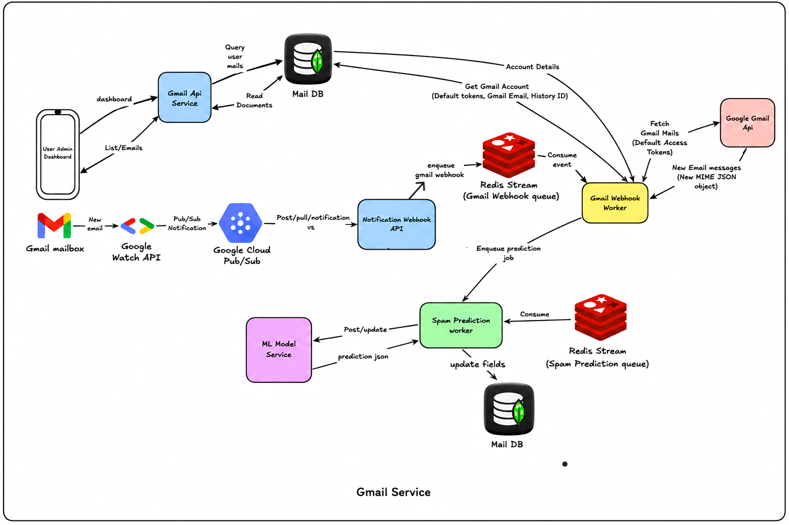
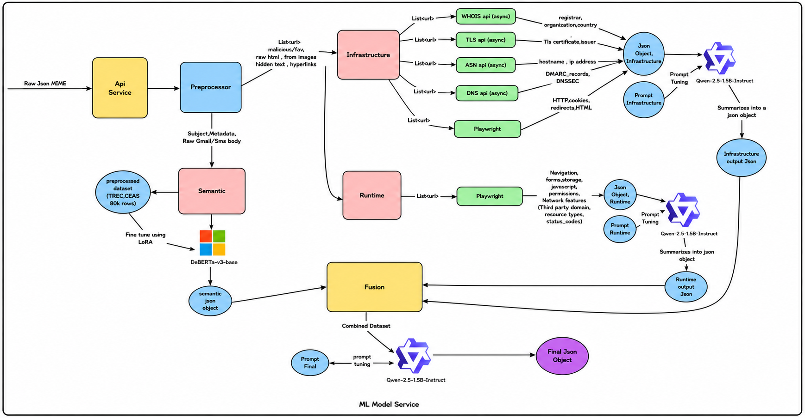

# AegisSecure — AI-Powered Phishing Detection Platform

**Demo:** https://youtu.be/0l0s7oldu2I

---

## Overview

AegisSecure is an AI-powered phishing detection platform that continuously monitors Gmail and SMS messages, analyzes them using a hybrid machine learning pipeline, and provides real-time phishing predictions with detailed explanations.

The system combines semantic understanding, infrastructure analysis, and runtime behavior analysis to generate explainable phishing decisions while supporting asynchronous event-driven processing for scalable inference.

---

## Features

- Real-time Gmail and SMS monitoring
- AI-powered phishing detection
- Manual email/SMS analysis
- Explainable predictions with reasoning
- Suspicious content highlighting
- Threat confidence score
- Security recommendations
- Analytics dashboard
- Gmail synchronization
- JWT-based authentication

---

## System Architecture

    

The backend follows an asynchronous event-driven architecture. Gmail notifications are received through the Gmail Watch API and Google Cloud Pub/Sub, processed using Redis Streams and background workers, and finally passed to the ML inference pipeline before updating the user dashboard.

---

## ML Inference Pipeline

    

The ML pipeline combines three complementary components:

- Semantic analysis using a LoRA fine-tuned DeBERTa-v3 model
- Infrastructure analysis using WHOIS, DNS, ASN, TLS, and Playwright
- Small Language Models (Qwen 2.5 Instruct) for structured reasoning and evidence fusion

The outputs from these stages are fused to generate the final phishing prediction and explanation.

---

## Technical Highlights

- LoRA fine-tuned DeBERTa-v3-base for semantic phishing detection
- Asynchronous WHOIS, DNS, ASN, and TLS feature extraction
- Runtime webpage analysis using Playwright
- Gmail Watch API + Google Cloud Pub/Sub integration
- Redis Streams for background job processing
- FastAPI microservices
- Flutter mobile application
- MongoDB for email storage
- JWT authentication
- Explainable AI reasoning using Qwen 2.5 Small Language Models

---

## Application Preview

    
    
    
    

---

## Model Performance

### Accuracy Comparison

    

### Confusion Matrix

    

